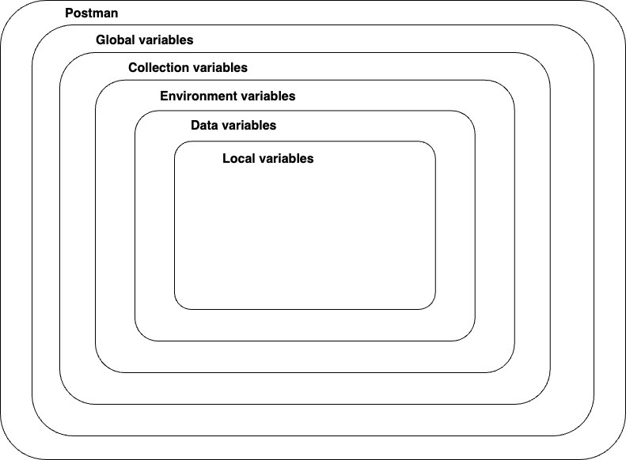

###### Postman Academy Documentation : https://academy.postman.com/path/postman-api-fundamentals-student-expert/postman-api-fundamentals-student-expert-certification-1/1811

###### Postman Doc Link : https://letsupgrade.notion.site/Postman-Student-Expert-Certification-in-2-Days-fd88d22299b74158a05aaf8723504ee9 
<br>


# POSTMAN API FUNDAMENTALS
<br>

## UNDERSTANDING APIs 

### What is an API?
- API stands for **Application Programming Interface**.
- It's a way for different software applications to communicate with each other.

### Analogy: Restaurant Scenario
- **Customer**: Represents the user or client.
- **Waiter**: Acts as the API, facilitating communication between the customer and the kitchen.
- **Kitchen**: Corresponds to the backend service or server where the actual work occurs.

### Digital World Equivalence
- **Client**: You or your application.
- **API**: Acts as an intermediary, allowing your application to communicate with another application or service.
- **Backend System**: The other application or service where data processing, storage, or modification occurs.

### How APIs Work
- APIs define a set of **rules and protocols** for communication.
- They specify how different software components should **interact**, what **data** can be accessed or manipulated, and what **actions** can be performed.
- APIs enable developers to access specific features or functionalities of another application without understanding its internal workings.
- This fosters **interoperability** and facilitates the development of complex software systems by combining the capabilities of multiple components.

<br>


## Types of APIs


### Types of APIs based on Access, Medium, and Architecture

### 1. Access:

- **Open APIs (Public APIs)**:
   - These APIs are freely available to the public.
   - Designed for wide usage and accessibility.
   - Examples include social media APIs like Twitter, Facebook, etc.

- **Internal APIs (Private APIs)**:
   - Used within organizations for internal purposes.
   - Not exposed to the public.
   - Facilitate communication between internal systems or departments.

- **Partner APIs (B2B APIs)**:
   - Shared with trusted external partners or collaborators.
   - More restricted access compared to open APIs.
   - Used for sharing data and functionality with business partners.

### 2. Medium:

- **HTTP APIs**:
   - Utilize HTTP/HTTPS protocol for communication.
   - Commonly used for web-based APIs.
   - Examples include RESTful APIs and SOAP APIs.

- **WebSocket APIs**:
   - Enable bidirectional communication between client and server.
   - Suitable for real-time applications.
   - Used for applications requiring low latency and high concurrency.

- **GraphQL APIs**:
   - Allow clients to query only the data they need.
   - Provide a flexible and efficient approach to data retrieval.
   - Commonly used for building APIs that serve client-specific data requirements.

### 3. Architecture:

- **RESTful APIs**:
   - Follow the principles of Representational State Transfer (REST).
   - Stateless communication between client and server.
   - Use standard HTTP methods (GET, POST, PUT, DELETE).
   - Represent resources as URIs.
   - Examples include APIs for web services, e.g., Twitter API.

- **SOAP APIs**:
   - Based on the Simple Object Access Protocol (SOAP).
   - Use XML for message format.
   - Often used in enterprise environments.
   - Known for strong reliability and transactional support.

- **RPC APIs (Remote Procedure Call)**:
   - Allow clients to execute procedures or functions on remote servers.
   - Encapsulate function calls within network messages.
   - Examples include gRPC, XML-RPC.

- **Event-Driven APIs**:
   - Facilitate communication between components through events.
   - Decoupled architecture with event producers and consumers.
   - Suitable for asynchronous and loosely coupled systems.

These categorizations provide a comprehensive overview of different types of APIs based on their accessibility, communication medium, and architectural principles. The choice of API type depends on factors such as the specific use case, requirements, and constraints of the system being developed.

<br>

## POSTMAN

### Role of Postman in APIs

Postman is a popular tool used by developers to work with APIs. Its primary roles include:

1. **API Development**: Postman provides a platform for developers to design, build, and test APIs. Developers can create API endpoints, define request parameters, and set up response structures.

2. **API Testing**: It allows developers to send requests to APIs and analyze the responses. Postman offers a user-friendly interface for sending various types of requests such as GET, POST, PUT, DELETE, etc. Developers can also set up automated tests to ensure API functionality and performance.

3. **Documentation Generation**: Postman can automatically generate documentation for APIs based on the requests and responses configured within the tool. This documentation includes details such as endpoint URLs, request parameters, response formats, and examples.

4. **Collaboration**: Postman facilitates collaboration among team members working on API-related projects. Developers can share collections of requests, collaborate on API development and testing, and synchronize changes across team members.

5. **Monitoring and Debugging**: Postman allows developers to monitor API performance and debug issues. It provides insights into response times, error rates, and other metrics, helping developers identify and troubleshoot issues efficiently.

6. **Mock Servers**: Postman can create mock servers that simulate API behavior. This is useful during development and testing when the actual backend server may not be available or ready. Mock servers generate realistic responses based on predefined request-response pairs, enabling developers to test client applications effectively.

In summary, Postman plays a crucial role in the entire lifecycle of APIs, from development and testing to documentation and monitoring, making it an essential tool for API-centric development projects.

<br>

## cURL vs Postman

### cURL (Client for URLs)

1. **Command Line Tool**: cURL is a command-line tool used to transfer data using various network protocols, including HTTP, HTTPS, FTP, etc.
  
2. **Flexibility**: It provides a simple and flexible way to send HTTP requests with various options for customization.
  
3. **Automation**: cURL can be easily integrated into scripts and automated processes, making it suitable for tasks requiring command-line execution.
  
4. **Basic Features**: While powerful, cURL primarily offers basic functionalities such as sending requests, setting headers, and handling responses.
  
5. **Lack of GUI**: It lacks a graphical user interface (GUI), which may make it less user-friendly for some developers, especially those who prefer visual tools.

### Postman

1. **GUI Application**: Postman is a GUI-based application specifically designed for working with APIs.
  
2. **User-Friendly Interface**: It offers a user-friendly interface for building, testing, and debugging APIs, making it accessible to developers of all skill levels.
  
3. **Rich Feature Set**: Postman provides a wide range of features beyond basic request sending, including API documentation generation, automated testing, collaboration tools, monitoring, and mocking servers.
  
4. **Collections**: Postman allows developers to organize API requests into collections, making it easy to manage and share sets of requests with team members.
  
5. **Environment Variables**: It supports environment variables, allowing developers to define variables for dynamic data and streamline the testing process across different environments.
  
6. **Visual Debugging**: Postman offers visual debugging tools, making it easier to inspect request and response details, track variables, and troubleshoot issues.
  
7. **Integration with Third-Party Services**: Postman integrates with various third-party services and platforms, enhancing its capabilities for API development and testing.

#### Conclusion

- **cURL** is a powerful command-line tool suitable for quick and straightforward HTTP requests and automation tasks.
  
- **Postman** provides a comprehensive GUI-based platform tailored for API development, testing, documentation, and collaboration, offering a more robust and user-friendly experience for working with APIs.

<br>


## Request-Response Pattern in APIs


### 1. **Request Phase**:
   - **Client Sends Request**: The client, which could be a web browser, mobile application, or another server, sends a request to the API server. This request typically includes:
     - **Endpoint**: The specific URL or route that the client wants to access on the server.
     - **HTTP Method**: The type of action the client wants to perform, such as GET, POST, PUT, DELETE, etc.
     - **Headers**: Additional metadata or information accompanying the request, such as authentication tokens, content type, etc.
     - **Body (for some requests)**: Data sent to the server, usually for operations like creating or updating resources.

### 2. **Server Processing**:
   - **Routing**: The API server receives the request and routes it to the appropriate endpoint based on the URL and HTTP method specified in the request.
   - **Authentication & Authorization**: The server may authenticate the client's request to ensure it has the necessary permissions to access the requested resource.
   - **Data Processing**: The server processes the request, which may involve querying a database, performing calculations, or interacting with other services.
   - **Business Logic**: Any business rules or logic associated with the requested operation are executed.

### 3. **Response Phase**:
   - **Server Sends Response**: After processing the request, the server generates a response to send back to the client. This response typically includes:
     - **HTTP Status Code**: Indicates the outcome of the request (e.g., success, error, redirection, etc.).
     - **Headers**: Additional metadata accompanying the response, such as content type, caching directives, etc.
     - **Body (for most responses)**: Data sent back from the server to the client. This could be the requested resource, error messages, or other relevant information.

### 4. **Client Handling**:
   - **Response Parsing**: The client receives the response from the server and parses it to extract relevant data.
   - **Error Handling**: If the response indicates an error (e.g., 4xx or 5xx status code), the client may handle it accordingly, displaying error messages to the user or retrying the request.
   - **Data Display or Further Processing**: If the response is successful, the client may display the received data to the user, process it further, or take additional actions based on the response content.

### 5. **Optional Caching and Optimization**:
   - **Caching**: Both the client and server may utilize caching mechanisms to optimize performance by storing and reusing previously fetched data.
   - **Optimization Techniques**: Various optimization techniques such as compression, minification, and lazy loading may be employed to improve the efficiency of data transmission between the client and server.

### Conclusion:
The request-response pattern forms the backbone of communication between clients and servers in API-based systems. Understanding this pattern is crucial for building, consuming, and troubleshooting APIs effectively.

<br>

## Making a Request


To make a request, you typically need three essential ingredients:

1. **HTTP Method**:
   - The HTTP method specifies the type of action you want to perform on the server's resource. Common methods include:
     - **GET**: Retrieve data from the server.
     - **POST**: Submit data to the server to create a new resource.
     - **PUT**: Update an existing resource on the server.
     - **DELETE**: Remove a resource from the server.
     - And others like PATCH, HEAD, OPTIONS, etc.

    
    
    

2. **Address/Endpoint (URL)**:
   - The address or endpoint specifies the location of the resource on the server that you want to interact with. It's a unique identifier that the server uses to route your request to the appropriate handler. For example:
     ```
     https://api.example.com/resource
     ```

3. **Path**:
   - The path is a specific part of the URL that further specifies the location of the resource within the endpoint. It comes after the domain name and any optional parameters. For example, in the URL `https://api.example.com/users/123`, `/users/123` is the path, where `123` is a unique identifier for a specific user.

These three ingredients, combined together, provide the necessary information for the client to communicate with the server and perform the desired action on the resource.

<br>

## Status Codes

HTTP status codes are standardized responses that servers send back to clients (such as web browsers or API consumers) to indicate the success or failure of a request. Here's an overview of some common HTTP status codes:

### 1xx Informational
- **100 Continue**: The server has received the request headers and the client should proceed to send the request body.
- **101 Switching Protocols**: The server is switching protocols per the client's request.

### 2xx Success
- **200 OK**: The request was successful.
- **201 Created**: The request has been fulfilled, and a new resource has been created.
- **204 No Content**: The server successfully processed the request but is not returning any content.

### 3xx Redirection
- **301 Moved Permanently**: The requested resource has been permanently moved to a new location.
- **302 Found (Temporary Redirect)**: The requested resource has been temporarily moved to a different URI.
- **304 Not Modified**: Indicates that the resource has not been modified since the version specified by the request headers.

### 4xx Client Errors
- **400 Bad Request**: The server cannot process the request due to a client error, such as malformed syntax.
- **401 Unauthorized**: The request requires user authentication.
- **403 Forbidden**: The server understood the request but refuses to authorize it.
- **404 Not Found**: The server cannot find the requested resource.

### 5xx Server Errors
- **500 Internal Server Error**: A generic error message indicating that the server encountered an unexpected condition.
- **502 Bad Gateway**: The server received an invalid response from an upstream server while attempting to fulfill the request.
- **503 Service Unavailable**: The server is currently unable to handle the request due to temporary overload or maintenance.
- **504 Gateway Timeout**: The server, while acting as a gateway or proxy, did not receive a timely response from the upstream server.

These status codes provide a standardized way for servers to communicate the outcome of a request, allowing clients to understand and respond appropriately. Understanding these status codes is essential for troubleshooting issues when working with web services or APIs.

<br>

## Variables in Postman

In Postman, variables are placeholders that allow you to store and reuse values throughout your requests, scripts, and environments. They provide flexibility and efficiency in managing data, such as API endpoints, authentication tokens, or dynamic values. Here's how variables work in Postman:

### Types of Variables in Postman:

1. **Global Variables**:
   - Global variables are accessible across all requests, collections, and environments within your Postman workspace.
   - They are defined at the workspace level and can be used anywhere in your requests or scripts.
   - Global variables are useful for storing common data that is shared among multiple requests.

2. **Environment Variables**:
   - Environment variables are specific to a particular environment within your workspace.
   - Environments in Postman allow you to define sets of variables for different deployment environments like development, staging, or production.
   - You can switch between environments to dynamically change the values of variables used in requests.

3. **Collection Variables**:
   - Collection variables are scoped to a specific collection and can be used across all requests within that collection.
   - They provide a way to share data among related requests within the same collection.

4. **Local Variables**:
   - Local variables are defined and used within a specific request or script.
   - They have the narrowest scope and are only accessible within the context in which they are defined.
   - Local variables are useful for temporary data manipulation or for storing values during script execution.

### Working with Variables in Postman:

- **Setting Variables**:
  - Variables can be set manually in the Postman UI by defining key-value pairs.
  - They can also be set dynamically using scripts to extract values from responses, generate random data, or perform calculations.

- **Using Variables**:
  - Variables can be used in various places within Postman, including request URLs, headers, request bodies, and scripts.
  - To use a variable, enclose its name within double curly braces (`{{variable_name}}`) in the appropriate field.

- **Scope and Precedence**:
  - Variables have different scopes (global, environment, collection, local) and precedence levels.
  - Local variables take precedence over collection variables, which take precedence over environment variables, and so on.

- **Dynamic Variables**:
  - Postman provides built-in dynamic variables for commonly used data, such as timestamps, random numbers, and GUIDs.
  - These dynamic variables can be inserted directly into requests or scripts without manual definition.

- **Managing Variables**:
  - Postman provides a Variables tab where you can view, edit, and manage variables for the current request, collection, or environment.
  - You can also import/export variables to share them across different workspaces or environments.

### Benefits of Using Variables in Postman:

- **Flexibility**: Variables allow for dynamic and reusable values in requests and scripts.
- **Consistency**: Centralized management of variables ensures consistent data across requests and environments.
- **Efficiency**: Saves time by reducing the need for manual data entry and maintenance.
- **Scalability**: Easily scale and manage variables as your project grows in complexity.

In summary, variables in Postman are powerful tools for managing and manipulating data in your API testing and development workflows. They provide flexibility, efficiency, and consistency in working with dynamic values across requests, collections, and environments.


<br>

## Query Parameters
Remember that the minimum ingredients you need to make a request are:

- a request method (GET/POST/PUT/PATCH/DELETE, etc)
- a request URL

Some APIs allow you to refine your request further with key-value pairs called **query parameters**. 

### Query parameter syntax
Query parameters are added to the end of the path. They start with a question mark ?, followed by the key-value pairs in the format: `<key>=<value>`. For example, this request might fetch all photos that have landscape orientation:

`GET https://some-api.com/photos?orientation=landscape`

If there are multiple query parameters, each is separated by an ampersand `&`. Below two query parameters to specify the orientation and size of the photos to be returned:

`GET https://some-api.com/photos?orientation=landscape&size=500x400`

### Search Google - with query parameters!
Try pasting this URL into your browser or as a GET request in Postman to make a Google search for "Postman". (If you use Postman, click the "Preview" tab in the response to view the rendered HTML!)

`https://www.google.com/search?q=postman`

This request adds a search term as a query parameter `q=postman` ("q" refers to "query" here) to the `GET /search` path on Google's server.

Because this parameter is in our request, the server returns an HTML document that is a search results page with hits for "Postman". The search bar is pre-populated with our query "Postman".

<br>

## Path Parameters

### Path Variable
Another way of passing request data to an API is via path variables (a.k.a. "path parameters"). A path variable is a dynamic section of a path and is often used for IDs and entity names such as usernames. 

### Path Variable syntax
The path variable comes immediately after a slash in the path. For example, the GitHub API allows you to search for GitHub users by providing a username in the path in place of `{username}` below: 

`GET https://api.github.com/users/{username}`

Making this API call with a value for `{username}` will fetch data about that user:

`GET https://api.github.com/users/postmanlabs`

You can have multiple path variables in a single request, such as this endpoint for getting a user's GitHub code repository:

`GET https://api.github.com/repos/{owner}/{repoName}`

For example, to get information about the `newman` code repository from `postmanlabs`:

`GET https://api.github.com/repos/postmanlabs/newman`


### Path vs. query parameters
At first, it is easy to confuse these two parameter types. Let's compare them side by side. 

| Path Variable        | Query parameters           |
|----------------------|----------------------------|
| ex: `/books/abc123`    | ex: `/books?search=borges&checkedOut=false` |
| Located directly after a slash in the path. It can be anywhere on the path | Located only at the end of a path, right after a question mark ? |
| Accepts dynamic values | Accepts defined query keys with potentially dynamic values. |
| *Often used for IDs or entity names | *Often used for options and filters |

**These are just conventions! Some APIs might ask you to pass an ID or username in a query parameter like this: `/users?username=getpostman`* 

Note that some API documentation uses colon syntax to represent a wildcard in the path like `/users/:username`, while some use curly braces like `/users/{username}`. They both mean the same thing: that part of the path is dynamic!

<br>

## Authorization

Think about why you might not want an API to have completely open endpoints that anyone can access publicly. It would allow unauthorized people to access data they shouldn't see, or allow bots to flood an API with thousands of calls per second and shut it down. 

There are multiple methods for authorizing a request. Some examples are **Basic Auth** (username and password), **OAuth**(delegated authorization), and **API Keys** (secret strings registered to a developer from an API portal). 

### Getting an API Key
APIs that use API Key auth usually allow developers to sign up in a developer portal, where they will receive a random API Key that can be used to authorize their requests to the API. The API Key allows the API to track who is making calls and how often.  

The Postman Library API v2 uses very light protection and does not require you to register for an API Key. You simply have to know it:

Header name: `api-key` <br>
Header value: `postmanrulz`

As the documentation shows, the Postman Library API v2 requires adding this **header** to any requests for adding, updating and deleting books, since these operations change data in the database instead of simply reading them.

### Headers
Headers are how we can add **metadata** about our requests, such as authorization information or specify the data type we want to receive in a response. This is different than the actual payload data we send in the body of a request, such as our new book information.

You can think of headers like the outside of an envelope when you send a letter. The envelope has information about delivering the letter, like proof that you've paid for postage. The actual data "payload" is the letter inside the envelope.

<br>

## Variables in Postman (Continued)
Previously in the "Request Parameters" section of this course, we saw how using a variable saved us time and helped reduce redundant copy-paste of the request URL using the double curly brace syntax like this: `{{variableName}}`.

Remember, Postman allows you to save values as variables so that you can:  

1. Reuse values to keep your work DRY (Don’t Repeat Yourself)

2. Hide sensitive values like API keys from being shared publicly

In this section, we will learn more about variables and introduce better practices that enable us to make dynamic requests. 

### Variable scopes
You can set variables that live at various scopes. Postman will resolve to the value at the nearest and narrowest scope.

From broadest to narrowest, these scopes are global, collection, environment, data, and local.



If a variable with the same name is declared in two different scopes, the value stored in the variable with narrowest scope will be used. For example, if there is a global variable named `username` and a local variable named `username`, the local value will be used when the request runs.

We will work with collection variables today, which live at the collection level and can be accessed anywhere inside the collection.

In the next section, you will learn how to set a variable via scripting.

<br>

## Setting variables programmatically

### Scripting in Postman
Postman allows you to add automation and dynamic behaviors to your collections with scripting.

Postman will automatically execute any provided scripts during two events in the request flow:

Immediately before a request is sent: pre-request script (**Pre-request Script** tab of request).
Immediately after a response comes back: test script (**Tests** tab of request).
In this lesson, we will focus on writing scripts in the **Tests** tab, which are executed when a response comes back from an API.

### The `pm` object
Postman has a helper object named `pm` that gives you access to data about your Postman environment, requests, responses, variables and testing utilities. 

For example, you can access the JSON response body from an API with: 

`pm.response.json()`

You can also programmatically get collection variables like the value of `baseUrl` with:

`pm.collectionVariables.get(“baseUrl”)`

In addition to getting variables, you can also set them with `pm.collectionVariables.set("variableName", "variableValue")` like this:

`pm.collectionVariables.set(“myVar”, “foo”)`


